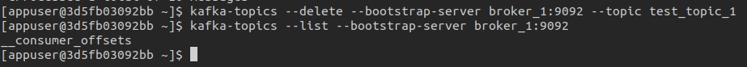

#### 1. docker ps -a


#### 4. Create a topic
```kafka-topics --create --bootstrap-server broker_1:9092 --topic test_topic_1```


#### 5. List topics
```kafka-topics --list --bootstrap-server broker_1:9092```


#### 6. Sent at least 10 simple text messages with the console producer
```
    kafka-console-producer --topic test_topic_1 --bootstrap-server broker_1:9092 --property key.separator=, --property parse.key=true
    >Ukraine,Kyiv
    >Ukraine,Sumy
    >Ukraine,Lviv
    >Ukraine,Donetsk
    >Switzerland,Bern
    >Switzerland,Geneva
    >Austria,Vienna
    >Poland,Warsaw
    >Lithuania,Vilnius
    >Portugal,Lisbon
```


#### 7. Receive the messages with the console  consumer
`kafka-console-consumer --topic test_topic_1 --bootstrap-server broker_1:9092 --property print.key=true --from-beginning`


#### 8. Delete the topic
`kafka-topics --delete --bootstrap-server broker_1:9092 --topic test_topic_1`


