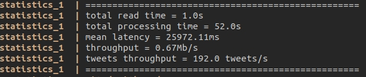
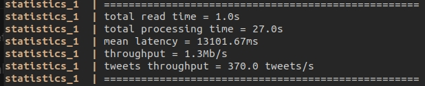
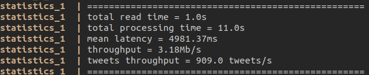
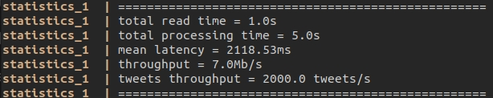
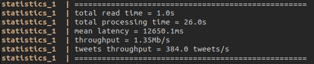
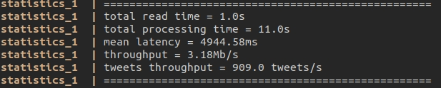
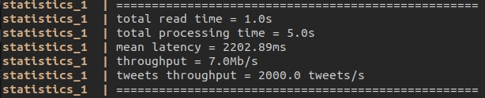
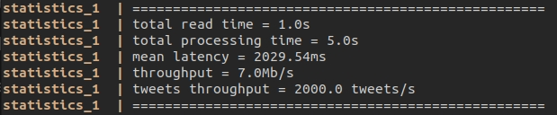

#### 6.1 One producer, a topic with one partition, one consumer

#### 6.2 One producer, a topic with 2 partitions, one consumer

#### 6.3 One producer, a topic with 5 partitions, one consumer

#### 6.4 One producer, a topic with 10 partition, one consumer

#### 6.5 One producer, a topic with 2 partitions, 2 consumers

#### 6.6 One producer, a topic with 5 partitions, 2 consumers

#### 6.7 One producer, a topic with 10 partitions, 2 consumers

#### 6.8 One producer, a topic with 10 partitions, 10 consumers

#### 6.9 2 producers, a topic with 10 partitions, 10 consumers

P.S. увімкнена опція `partitionsConsumedConcurrently`