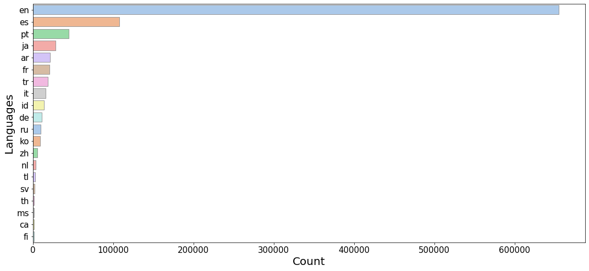
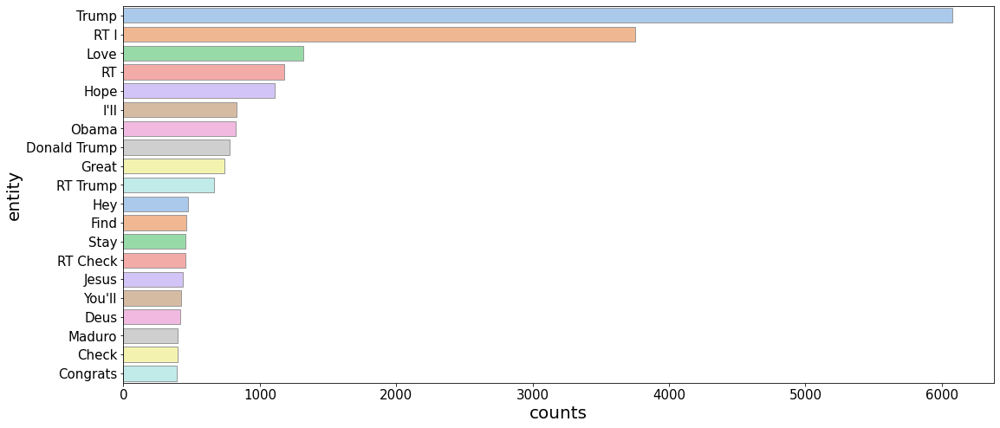
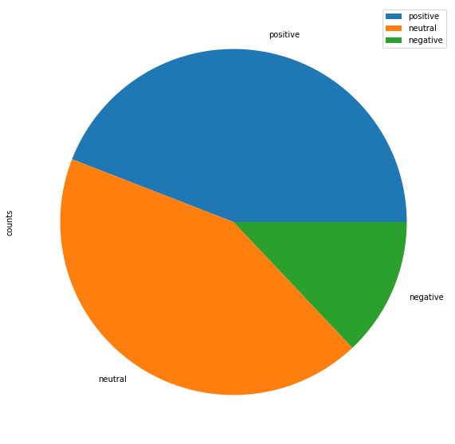
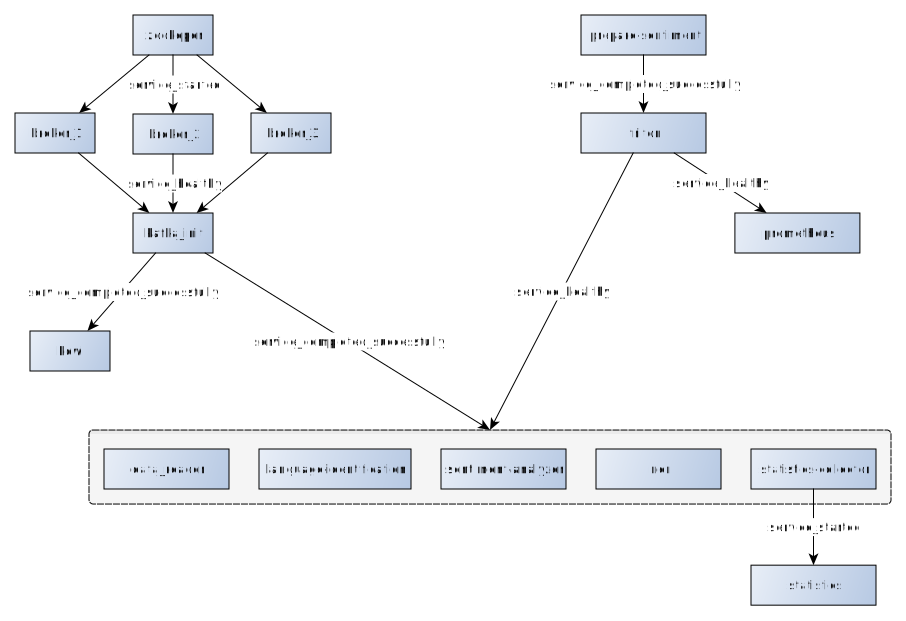
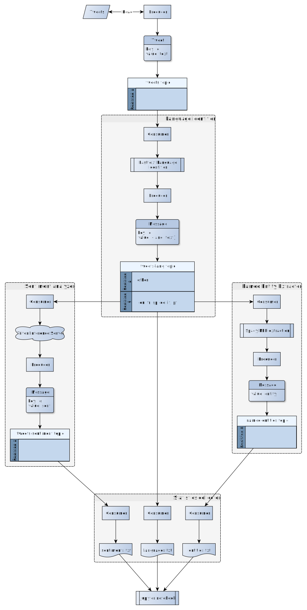

This repository contains course work on "Project B. E2E data processing pipeline - processing social media data (twitter)"

### Steps to start the service

1. Clone this repository - `git clone git@github.com:de-ucu/data-streaming.git`
2. Go in the corresponding folder `cd data-streaming`
3. Download the dataset (1M tweets) - `curl -o data/1M.jsonl.gz --create-dirs https://transfer.sh/1TsjzT4/1M.jsonl.gz`
4. To run this service you will need `docker-compose` installed - `docker-compose up --build`
5. Wait until all components will be up and running
6. Links:
   1. <http://127.0.0.1:8888> - jupyter lab (will require token from `statistics` service logs)
   2. <http://127.0.0.1:8080> - kowl
   3. <http://127.0.0.1:9090> - prometheus
7. To stop the service and remove all artifacts - `docker-compose down --volumes --rmi all`

### Statistics

#### Top 20 languages

#### Top 20 entities

#### Sentiments

### Microservices

1. Kafka group
   1. `zookeeper`
   2. Brokers
      1. `broker_1`
      2. `broker_2`
      3. `broker_3`
   3. `kafka-init` - creates neccessary topics
2. `data-reader` - reads the local dataset and sends tweets to kafka
3. Inference group
   1. `prepare-sentiment` - downloads transformer model for multilingual sentiment analysis from Huggingface repository and converts it into onnx format
   2. `triton` - Triton Inference Server for serving transformer model in a better way
   3. `sentiment-analyzer` - service for consuming tweets and feeding them to `triton`
   4. `language-identification` - service for predicting tweets' language. Based on fasttext model
   5. `ner` - service for extracting named entities. Based on spacy's multilingual NER model
4. Statistics group
   1. `statistics-collector` - reads data from corresponding topics and streams it to filesystem
   2. `statistics` - reads files with data from `statistics-collector` and builds diagrams
5. Monitoring group
   1. `prometheus` - reads metrics from `triton` service and vidualizes them (e.g. gpu utilization, batches processed, etc.)
   2. `kowl` - dashboard for kafka

### Microservices starting order

### Service topology

